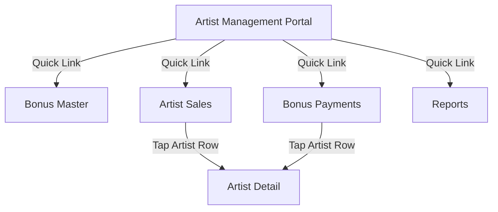
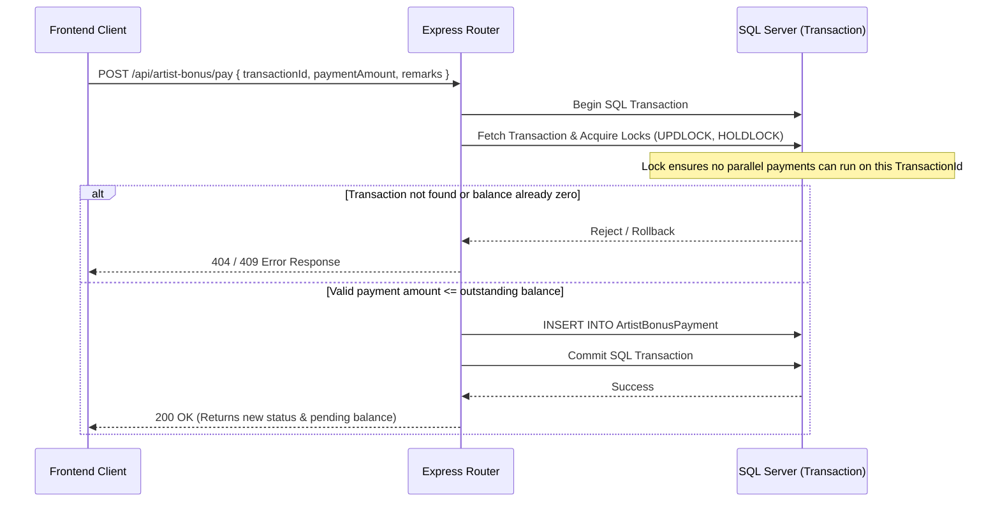

# Artist Management & Bonus System Analysis

This document provides a comprehensive, field-by-field architectural blueprint of how the **Artist Management and Bonus Incentive** module is designed and executed across the database, backend services, and frontend screens.

---

## 1. Core Concepts & Workflow

The system is designed around a **Double-Ledger Accounting Model**. Under this architecture:
1. **Artists as Products**: Artists are represented in the database as dishes in `DishMaster` where `IsSplitDish = 1` and `IsGroupDish = 0` (non-grouped split items).
2. **Sales Tracking**: Sales are captured from three separate sources:
   - **App POS Sales**: Normal items settled via `SettlementHeader` and `SettlementItemDetail`.
   - **Professional POS Sales**: Restaurant orders completed via `RestaurantOrder` and `RestaurantOrderDetail`.
   - **Cash Box Entries**: Direct manual payments recorded in `ArtistCashBox` under the artist's name.
3. **Rule-Based Incentives**: Bonuses are calculated based on rules defined in the system. Rules can be **Global** (applies to all artists) or **Specific** overrides for individual artists. Rules support **Repeating** milestones (every $X threshold earns $Y bonus) or **One-time** thresholds.
4. **Immutable Earnings Ledger**: Once bonuses are calculated (either on-demand or automatically at **Day-End**), they are recorded in `ArtistBonusTransaction`. This table acts as an immutable registry of earned bonuses and is never modified once finalized.
5. **Payments Ledger**: Payments are recorded in `ArtistBonusPayment`. Rather than updating a transaction's status directly, the payment status is derived dynamically on the fly by summarizing total payments against the earned bonus.

---

## 2. Database Schema Blueprint

The module leverages the following tables:

### A. Core Ledger Tables

#### 1. `ArtistBonusMaster` (Rule Configuration)
Stores the active rules determining when and how much bonus is paid.
* **`Id`** (`UNIQUEIDENTIFIER`, Primary Key): Unique identifier of the rule.
* **`ThresholdAmount`** (`DECIMAL(18, 2)`): The sales target that triggers the bonus (e.g. $500).
* **`BonusAmount`** (`DECIMAL(18, 2)`): The payout amount awarded when the threshold is met (e.g. $50).
* **`IsRepeating`** (`BIT`): 
  * `1` (Repeating): Earns multiple bonuses (e.g., $1000 sales earns 2x bonus).
  * `0` (One-time): Maximum of one bonus payout regardless of how far past the threshold sales go.
* **`IsActive`** (`BIT`): Determines if the rule is current. Only one global rule can be active at a time.
* **`ArtistDishId`** (`UNIQUEIDENTIFIER`, Nullable): If set, this rule overrides the global rule specifically for this artist. If NULL, it is a global rule.
* **`ArtistType`** (`NVARCHAR(100)`, Nullable): Metadata category for the artist.
* **`CreatedDate`** (`DATETIME`): Date when the rule was created.

#### 2. `ArtistBonusTransaction` (Immutable Earnings Registry)
Acts as the immutable record of bonus earned.
* **`Id`** (`UNIQUEIDENTIFIER`, Primary Key): Transaction ID.
* **`ArtistDishId`** (`UNIQUEIDENTIFIER`): Foreign key matching `DishMaster.DishId`.
* **`ArtistName`** (`NVARCHAR(200)`): Snapshotted name of the artist to preserve history.
* **`SalesFromDate`** (`DATETIME`): Start date of the period for which sales were calculated.
* **`SalesToDate`** (`DATETIME`): End date of the period for which sales were calculated.
* **`TotalSales`** (`DECIMAL(18, 2)`): The aggregate sales amount recorded during this period.
* **`ThresholdAmount`** (`DECIMAL(18, 2)`): The rule threshold in effect at the time of calculation.
* **`BonusRuleAmount`** (`DECIMAL(18, 2)`): The bonus payout amount per threshold in effect.
* **`BonusEarned`** (`DECIMAL(18, 2)`): The final calculated bonus earned (computed as `TotalSales / ThresholdAmount * BonusRuleAmount` if repeating).
* **`IsRepeating`** (`BIT`): The repeating status in effect at calculation.
* **`CreatedDate`** (`DATETIME`): Time the transaction was recorded.

#### 3. `ArtistBonusPayment` (Payments Ledger)
Tracks every payment made to an artist. Enables partial payments.
* **`Id`** (`UNIQUEIDENTIFIER`, Primary Key): Unique payment ID.
* **`BonusTransactionId`** (`UNIQUEIDENTIFIER`): Link to the target `ArtistBonusTransaction`.
* **`ArtistDishId`** (`UNIQUEIDENTIFIER`): The artist receiving the payment.
* **`ArtistName`** (`NVARCHAR(200)`): Snapshotted name of the artist.
* **`PaymentAmount`** (`DECIMAL(18, 2)`): Amount paid in this specific payment.
* **`PaidDate`** (`DATETIME`): Date the payment occurred.
* **`PaidBy`** (`NVARCHAR(100)`): Username of the cashier/admin executing the payout.
* **`Remarks`** (`NVARCHAR(500)`, Nullable): Optional notes (e.g. "Paid cash", "Settle week 29").
* **`CreatedDate`** (`DATETIME`): Timestamp when the payment was logged.

---

### B. Core Sales Sources

#### 4. `DishMaster` (Artist Register)
* **`DishId`** (`UNIQUEIDENTIFIER`, Primary Key): The artist's system ID.
* **`Name`** (`NVARCHAR(255)`): Artist's stage name.
* **`IsSplitDish`** (`BIT`): Must be `1` for artist incentive calculations.
* **`IsGroupDish`** (`BIT`): Must be `0`.
* **`IsActive`** (`BIT`): Must be `1` to participate in live business days.

#### 5. `SettlementHeader` & `SettlementItemDetail` (App POS Sales)
Tracks standard sales at the cash register.
* **`SettlementHeader.IsCancelled`** (`BIT`): Must be `0` (non-cancelled bills only).
* **`SettlementHeader.OrderType`** (`NVARCHAR`): Excludes `'CASHBOX'` orders to avoid double-counting.
* **`SettlementHeader.LastSettlementDate`** or **`start_date`**: Used to filter transactions within the active business day range.
* **`SettlementItemDetail.Status`** (`NVARCHAR`): Excludes `'VOIDED'` lines.
* **`SettlementItemDetail.Qty`** & **`Price`**: Multiplied to calculate sales revenue.

#### 6. `RestaurantOrder` & `RestaurantOrderDetail` (Professional POS Sales)
Tracks dining/event orders.
* **`RestaurantOrder.StatusCode`**: Must be `3` (completed orders).
* **`RestaurantOrderDetail.TotalDetailLineAmount`**: The item line cost.
* Excludes orders duplicated as bills in `SettlementHeader` (`SettlementHeader.BillNo = RestaurantOrder.OrderNumber`).

#### 7. `ArtistCashBox` (Direct Cash Box Entries)
Tracks cash paid directly at the artist stage / booth.
* **`ArtistName`** (`NVARCHAR(255)`): Matches the artist name.
* **`Amount`** (`DECIMAL(18, 2)`): Cash received.
* **`start_date`** / **`CreatedDate`**: Dates mapped to filter criteria.

---

## 3. How the Screens Work

The module consists of 6 core screens, each serving a unique stage in the workflow:



### 1. Artist Management Portal (`artist-management.tsx`)
* **Role**: The central dashboard for managers.
* **Functionality**:
  * Displays a high-profile **Pending Alert Banner** if there are unpaid bonuses outstanding.
  * Shows **Day Status Banner** identifying if a business day is active (with a green blinking `LIVE` badge).
  * Summarizes 4 key indicators in card layouts: **Artist Sales**, **Bonus Earned**, **Bonus Paid**, and **All-time Unpaid** balance.
  * Links to sub-management screens: Payments, Settings (Master), Sales, and Reports.

### 2. Bonus Master Rule Editor (`artist-bonus-master.tsx`)
* **Role**: Configures global or artist-specific thresholds.
* **Functionality**:
  * Displays active rules and lists historical inactive rules.
  * Supports creating or editing rules with input fields for **Threshold Amount ($)**, **Bonus Amount ($)**, and **Repeating Toggle**.
  * Shows a dynamic **Interactive Preview Table** calculating bonus payouts for 5 tiers based on the entered inputs.
  * Enforces database validation: only one global rule can be active at a time (warns if a user attempts to activate a second).

### 3. Artist Sales & Calculation Screen (`artist-sales.tsx`)
* **Role**: Tracks active day progress and handles calculations.
* **Functionality**:
  * Lists active artists and visualizes their live day sales progress toward targets using progress percentage bars.
  * Provides date picker filters (`From` / `To`) to look up historical summaries.
  * Features the **Calculate Button** which prompts a modal confirmation before invoking the backend aggregation route to finalize transactions.

### 4. Settle Payments Screen (`artist-bonus-payments.tsx`)
* **Role**: Handles payout transactions.
* **Functionality**:
  * Displays artists who have pending, unpaid balances.
  * Grouped by artist, presenting lists of outstanding period transactions.
  * Features a **Pay Period** button opening a modal with shortcut payment amount selections (`25%`, `50%`, `75%`, `100%` of outstanding balance).
  * Records payment amounts and optional cashier comments.

### 5. Artist Detail Screen (`artist-detail.tsx`)
* **Role**: Performance breakdown and historical ledger audit.
* **Functionality**:
  * Focuses on a single artist's profile.
  * Splits into three scrollable tabs: **Sales History** (individual item sales), **Bonus History** (earned milestones), and **Payment History** (past payouts).
  * Permits direct settlements from the artist's card file.

### 6. Audit & History Reports (`artist-reports.tsx`)
* **Role**: Financial auditing.
* **Functionality**:
  * Generates tabular and exportable reports including:
    * **Sales Performance Report**: Ranked sales and earned stats.
    * **Bonus Ledger**: Granular transactional audit logging.
    * **Payment Ledger**: Audit trail of who paid whom and when.

---

## 4. How Bonus is Paid (The API Workflow)

The payout process is strictly managed via a backend transaction wrapper (`POST /api/artist-bonus/pay`) to ensure data integrity and avoid race conditions.



### Step-by-Step Execution:
1. **Request Submission**: The frontend submits the payload:
   ```json
   {
     "transactionId": "UUID-OF-EARNED-RECORD",
     "paymentAmount": 50.00,
     "remarks": "Paid in cash after night end"
   }
   ```
2. **Transaction Initiation**: The backend opens an SQL transaction block.
3. **Pessimistic Locking**: The server queries the earned record using SQL locks:
   ```sql
   SELECT Id, ArtistDishId, ArtistName, BonusEarned 
   FROM ArtistBonusTransaction WITH (UPDLOCK, HOLDLOCK) 
   WHERE Id = @id
   ```
   * *Why?* This ensures no concurrent requests can settle this same transaction simultaneously, avoiding double-payouts.
4. **Validation Check**: The server runs:
   $$\text{Pending Balance} = \text{BonusEarned} - \sum(\text{Existing PaymentAmounts})$$
   * If the balance is zero, the transaction rolls back with a `409 Conflict`.
   * If the requested payment exceeds the pending balance, the transaction rolls back with a `400 Bad Request`.
5. **Ledger Insertion**: A new entry is written to `ArtistBonusPayment`.
6. **Commit & Dynamic State Refresh**: The database commits the transaction. The API returns the newly calculated state (`status`, `pendingBonus`, `totalPaid`) back to the client.

---

## 5. Summary Table: Status Derivation Matrix

Because the status is never hardcoded inside `ArtistBonusTransaction` or `ArtistBonusPayment`, it is computed dynamically by the helper function `deriveStatus(bonusEarned, bonusPaid)` in `artistBonus.js`:

| Earned Amount | Total Paid Amount | Context | Derived Status |
| :--- | :--- | :--- | :--- |
| $\le 0$ | $0$ | Sales didn't reach threshold | `No Bonus` |
| $> 0$ | $0$ | Finalized, but no payment made yet | `Pending` |
| $> 0$ | $> 0$ and $<$ Earned | Partial settlement | `Partially Paid` |
| $> 0$ | $\ge$ Earned | Paid in full | `Paid` |
| $> 0$ | $0$ | Ongoing Active Day view (unfinalized) | `Accruing` |
